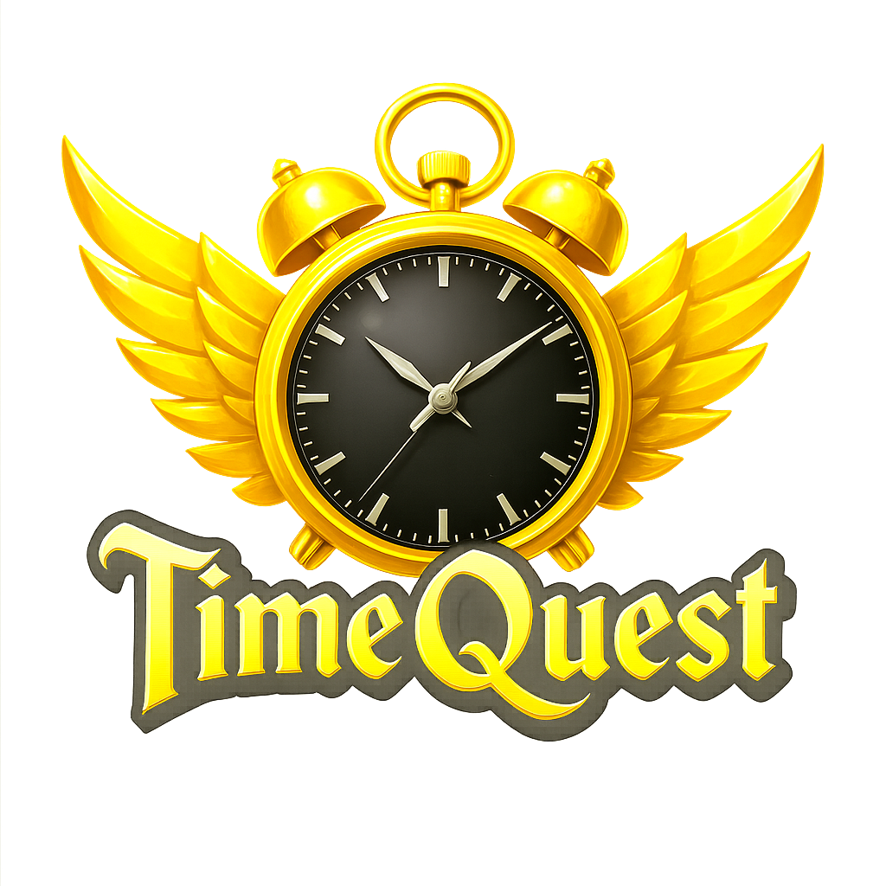

# 🎮 TimeQuest - Gamified Productivity App

<div align="center">
  

  **Transform your productivity into an epic quest!**

  [](https://reactjs.org/)
  [](https://www.typescriptlang.org/)
  [](https://tailwindcss.com/)
  [](https://vitejs.dev/)

</div>

---

## 🌟 Overview

TimeQuest is a revolutionary productivity application that transforms mundane task management into an engaging, gamified experience. With its retro-futuristic design and comprehensive feature set, TimeQuest makes productivity addictive through rewards, achievements, and social competition.

**🚀 Live Demo**: [TimeQuest App](https://timequest-mauve.vercel.app/)

---

## ✨ Key Features

### 🎯 **Core Productivity**

- **Smart Task Management**: Create, organize, and track tasks with duration estimates
- **Advanced Timer System**: Pomodoro, Focus, Sprint, and Custom timer presets
- **Real-time Progress Tracking**: Live updates without page refreshes
- **Persistent Mini Timer**: Always-visible timer for active tasks

### 🎮 **Gamification System**

- **Coin Economy**: Earn coins for completed tasks and focus sessions
- **Level Progression**: Advance through levels with XP-based system
- **Streak Tracking**: Maintain daily productivity streaks
- **Achievement System**: Unlock badges for various milestones

### 🏪 **Rewards Center**

- **Multi-tier Shop**: Power-ups, cosmetics, and premium items
- **Rarity System**: Common, Rare, Epic, and Legendary items
- **Achievement Gallery**: Track and showcase unlocked badges
- **Personal Inventory**: Manage purchased items and rewards

### 🎵 **Audio Experience**

- **Dynamic Timer Sounds**: Background audio during active sessions
- **Completion Alerts**: Satisfying completion sounds
- **Audio Library**: Multiple sound options (Simple Bell, Soft Bell, Ting Tong, etc.)
- **Smart Audio Management**: No overlapping sounds, proper pause/resume

### 👥 **Social Features**

- **Global Leaderboards**: Compete with other Quest Masters
- **Achievement Sharing**: Showcase your productivity milestones
- **Community Challenges**: Participate in daily, weekly, and monthly challenges
- **Friend System**: Connect with other users (Coming Soon)

### ⚙️ **Customization**

- **Theme System**: Dark/Light mode with retro-futuristic aesthetics
- **Custom Timer Presets**: Set your own work and break durations
- **Audio Preferences**: Choose and test different timer sounds
- **Profile Customization**: Personalize your Quest Master identity

---

## 🏗️ Project Structure

```
timequest/
├── public/
│   ├── sounds/                 # Timer audio files
│   ├── logotr.png             # TimeQuest logo
│   └── favicon.ico            # App favicon
├── src/
│   ├── components/
│   │   ├── ui/                # Reusable UI components
│   │   │   ├── button.tsx
│   │   │   ├── card.tsx
│   │   │   ├── dialog.tsx
│   │   │   ├── progress.tsx
│   │   │   ├── tabs.tsx
│   │   │   └── ...
│   │   ├── About.tsx          # About page component
│   │   ├── Auth.tsx           # Authentication component
│   │   ├── Contact.tsx        # Contact page component
│   │   ├── CreateTaskModal.tsx # Task creation modal
│   │   ├── Dashboard.tsx      # Main dashboard
│   │   ├── HowToUse.tsx       # Tutorial component
│   │   ├── MiniTimer.tsx      # Persistent mini timer
│   │   ├── Navigation.tsx     # App navigation
│   │   ├── RewardsPage.tsx    # Comprehensive rewards system
│   │   ├── Settings.tsx       # App settings
│   │   ├── SocialPage.tsx     # Social features hub
│   │   ├── TimerModal.tsx     # Quick timer modal
│   │   ├── TimerPage.tsx      # Advanced timer page
│   │   └── UserProfile.tsx    # User profile management
│   ├── contexts/
│   │   ├── AppStateContext.tsx # Global state management
│   │   └── AuthContext.tsx    # Authentication context
│   ├── hooks/
│   │   ├── use-mobile.tsx     # Mobile detection hook
│   │   └── use-toast.ts       # Toast notifications
│   ├── lib/
│   │   └── utils.ts           # Utility functions
│   ├── pages/
│   │   ├── Index.tsx          # Main app page
│   │   └── NotFound.tsx       # 404 page
│   ├── services/
│   │   └── mockData.ts        # Mock data service
│   ├── utils/
│   │   └── audioManager.ts    # Audio management system
│   ├── App.tsx                # Root component
│   ├── index.css              # Global styles
│   └── main.tsx               # App entry point
├── package.json               # Dependencies and scripts
├── tailwind.config.ts         # Tailwind configuration
├── tsconfig.json              # TypeScript configuration
└── vite.config.ts             # Vite configuration
```

---

## 🛠️ Technology Stack

### **Frontend Framework**

- **React 18** - Modern React with hooks and concurrent features
- **TypeScript** - Type-safe development experience
- **Vite** - Lightning-fast build tool and dev server

### **UI & Styling**

- **Tailwind CSS** - Utility-first CSS framework
- **shadcn/ui** - High-quality, accessible component library
- **Radix UI** - Unstyled, accessible UI primitives
- **Lucide React** - Beautiful, customizable icons

### **State Management**

- **React Context** - Global state management
- **React Hooks** - Local state and side effects
- **Custom Hooks** - Reusable stateful logic

### **Audio System**

- **Web Audio API** - Advanced audio management
- **Custom Audio Manager** - Singleton pattern for audio control

### **Development Tools**

- **ESLint** - Code linting and quality
- **TypeScript** - Static type checking
- **PostCSS** - CSS processing
- **Autoprefixer** - CSS vendor prefixing

---

## 🚀 Getting Started

### Prerequisites

- **Node.js** (v16 or higher)
- **npm** or **yarn**

### Installation

1. **Clone the repository**

   ```bash
   git clone <YOUR_GIT_URL>
   cd timequest
   ```
2. **Install dependencies**

   ```bash
   npm install
   ```
3. **Add audio files** (Optional)

   ```bash
   # Add audio files to public/sounds/
   # See public/sounds/README.md for file requirements
   ```
4. **Start development server**

   ```bash
   npm run dev
   ```
5. **Open your browser**

   ```
   http://localhost:5173
   ```

### Build for Production

```bash
# Build the application
npm run build

# Preview the build
npm run preview
```

---

## 🎨 Design System

### **Color Palette**

- **Primary Gold**: `hsl(45, 100%, 50%)` - Main accent color
- **Success Green**: `hsl(120, 80%, 40%)` - Positive actions
- **Background Dark**: `hsl(0, 0%, 4%)` - Main background
- **Card Background**: `hsl(0, 0%, 6%)` - Component backgrounds

### **Typography**

- **Orbitron**: Futuristic headings and important text
- **Inter**: Clean, readable body text

### **Animations**

- **Glow Effects**: Subtle pulsing glows on interactive elements
- **Hover Transitions**: Smooth 300ms transitions
- **Loading States**: Elegant loading animations

---

## 📱 Responsive Design

TimeQuest is fully responsive and optimized for:

- **Desktop** (1024px+): Full feature set with sidebar navigation
- **Tablet** (768px-1023px): Adapted layouts with touch-friendly controls
- **Mobile** (320px-767px): Bottom navigation with optimized touch targets

### Mobile-Specific Features

- Bottom navigation bar for easy thumb access
- Swipe gestures for navigation
- Optimized mini timer positioning
- Touch-friendly button sizes

---

## 🔧 Configuration

### **Audio Settings**

Configure timer sounds in the Settings page:

- Choose from multiple audio files
- Adjust volume levels
- Test audio before applying

### **Timer Presets**

Customize timer durations:

- **Pomodoro**: 25min work, 5min break, 15min long break
- **Focus**: 45min work, 10min break, 20min long break
- **Sprint**: 15min work, 3min break, 10min long break
- **Custom**: User-defined durations

### **Theme Customization**

- Dark/Light mode toggle
- Retro-futuristic color schemes
- Customizable UI elements

---

## 🎯 Core Features Deep Dive

### **Task Management System**

```typescript
interface Task {
  id: string;
  title: string;
  description: string | null;
  duration_minutes: number;
  status: 'pending' | 'in_progress' | 'completed' | 'abandoned';
  created_at: string;
  completed_at?: string | null;
  user_id: string;
  tags?: string[];
}
```

### **Gamification Engine**

- **Coin Calculation**: `Math.floor(duration_minutes / 5) * 10`
- **Level System**: XP-based progression with increasing requirements
- **Streak Logic**: Daily activity tracking with bonus multipliers

### **Audio Management**

```typescript
class AudioManager {
  // Singleton pattern for global audio control
  // Prevents audio conflicts
  // Manages background vs completion sounds
  // Handles pause/resume functionality
}
```

---

## 🔄 State Management

### **Global State (AppStateContext)**

- User profile data
- Real-time coin updates
- Cross-component communication

### **Local State**

- Component-specific UI state
- Form data and validation
- Temporary user interactions

### **Persistent Storage**

- LocalStorage for user preferences
- Settings persistence across sessions
- Custom timer configurations

---

## 🎵 Audio System

### **Supported Formats**

- WAV (recommended)
- MP3
- OGG

### **Audio Types**

1. **Background Timer Audio**: Loops during active sessions
2. **Completion Sounds**: Plays when timers finish
3. **UI Feedback**: Button clicks and interactions

### **Audio Files Required**

Place these files in `public/sounds/`:

- `simple.wav` - Simple bell sound
- `softbell.wav` - Soft bell sound
- `tingtong.wav` - Ting tong sound
- `ticktockclose.wav` - Tick tock close sound
- `retrogamingclock.wav` - Retro gaming clock sound
- `sound1digital.mp3` - Digital sound

---

## 🏆 Achievement System

### **Badge Categories**

- **Starter Badges**: First quest, first week
- **Consistency Badges**: Streak milestones
- **Volume Badges**: Task completion counts
- **Special Badges**: Unique accomplishments

### **Rarity Levels**

- **Common**: Basic achievements (gray)
- **Rare**: Moderate challenges (blue)
- **Epic**: Significant milestones (purple)
- **Legendary**: Ultimate achievements (gold)

---

## 🛒 Rewards Economy

### **Item Categories**

1. **Power-ups**: Temporary boosts and benefits
2. **Cosmetics**: Visual customizations
3. **Premium**: Exclusive features and themes
4. **Badges**: Achievement markers

### **Pricing Strategy**

- Power-ups: 50-200 coins
- Cosmetics: 250-500 coins
- Premium items: 750-1000+ coins

---

## 📊 Performance Optimizations

### **React Optimizations**

- Memoized components with `React.memo`
- Optimized re-renders with `useCallback` and `useMemo`
- Lazy loading for non-critical components

### **Audio Optimizations**

- Singleton audio manager prevents memory leaks
- Audio preloading for smooth playback
- Efficient audio cleanup on component unmount

### **Bundle Optimizations**

- Tree shaking for unused code elimination
- Code splitting for faster initial loads
- Optimized asset loading

---

## 🔒 Security Considerations

### **Data Protection**

- Client-side data validation
- Secure local storage practices
- No sensitive data in localStorage

### **Audio Security**

- Safe audio file handling
- Error boundaries for audio failures
- Graceful degradation without audio files

---

## 🚀 Deployment

### **Build Process**

```bash
npm run build
```

### **Deployment Options**

1. **Vercel**: Connect GitHub repository
2. **Netlify**: Drag and drop build folder
3. **Custom Server**: Upload dist folder

### **Environment Variables**

No environment variables required for basic functionality.

---

## 🤝 Contributing

### **Development Workflow**

1. Fork the repository
2. Create a feature branch
3. Make your changes
4. Test thoroughly
5. Submit a pull request

### **Code Standards**

- TypeScript for type safety
- ESLint for code quality
- Consistent naming conventions
- Comprehensive error handling

---

## 🙏 Acknowledgments

- **shadcn/ui** - For the beautiful component library
- **Radix UI** - For accessible UI primitives
- **Tailwind CSS** - For the utility-first styling approach

---

## 📞 Support

For support and questions:

- **Project URL**: https://timequest-mauve.vercel.app/
- **Issues**: Use GitHub Issues for bug reports and feature requests

---

<div align="center">
  <strong>🎮 Start your productivity quest today! 🎮</strong>

  Transform your daily tasks into epic adventures with TimeQuest.

</div>
